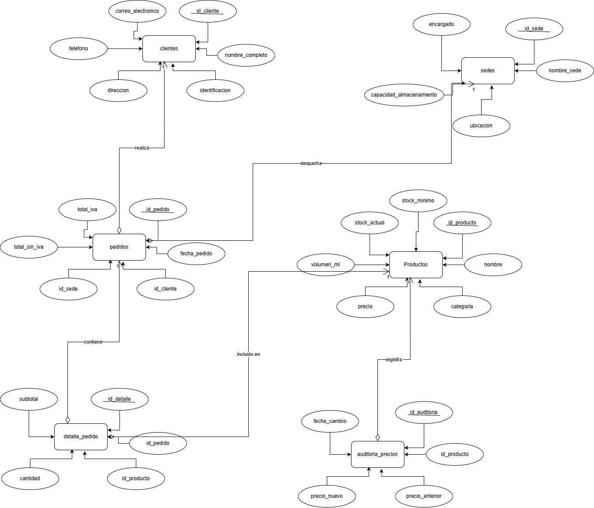
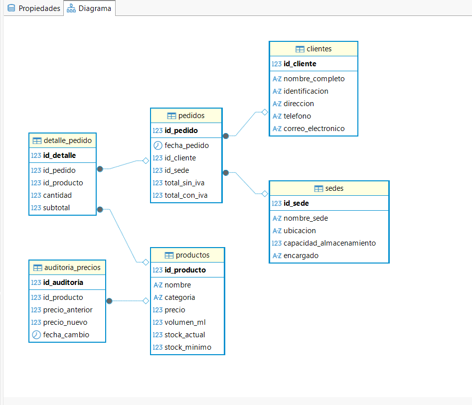
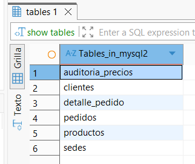
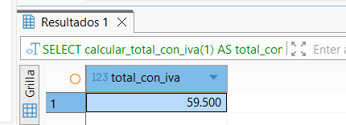
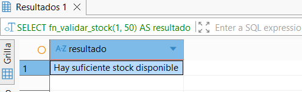

# Sistema de Gestión de Pedidos — Distribuidora de Bebidas

## ¿De qué trata este proyecto?

Este proyecto es una base de datos construida en MySQL para gestionar las operaciones de una distribuidora de bebidas que atiende a clientes en Bucaramanga, Girón y Piedecuesta. La idea es simple: llevar un control ordenado de quién compra, qué compra, desde qué sede se despacha y cuánto producto queda en inventario después de cada venta.

El sistema maneja clientes, sedes de distribución, productos (gaseosas, aguas, energizantes, isotónicas), pedidos y el detalle de cada uno. También guarda un historial de cambios de precios para tener trazabilidad.

---

## Modelo Entidad–Relación

El diagrama muestra cómo se relacionan las tablas entre sí:

```
CLIENTES ──────< PEDIDOS >────── SEDES
                    │
                    │
              DETALLE_PEDIDO
                    │
                    │
                PRODUCTOS ──── AUDITORIA_PRECIOS
```

**Descripción de las relaciones:**

- Un **cliente** puede tener muchos **pedidos**, pero cada pedido pertenece a un solo cliente.
- Cada **pedido** se genera desde una **sede** específica.
- Un **pedido** puede tener varios **productos** (eso es el detalle del pedido), y un producto puede aparecer en muchos pedidos.
- Cada vez que cambia el precio de un **producto**, se guarda un registro en **auditoria_precios**.





---

## Creación de tablas



## Tablas del sistema

| Tabla              | Para qué sirve                                               |
|--------------------|--------------------------------------------------------------|
| `clientes`         | Guarda los datos de cada cliente: nombre, documento, contacto |
| `sedes`            | Las sucursales de distribución con su capacidad y encargado  |
| `productos`        | El catálogo de bebidas con precio, volumen y stock           |
| `pedidos`          | Cada compra realizada, con fecha, cliente, sede y totales    |
| `detalle_pedido`   | Los productos específicos que tiene cada pedido              |
| `auditoria_precios`| Historial de cada vez que se modificó el precio de un producto |

---

## Funciones

### `calcular_total_con_iva(id_pedido)`

Esta función recibe el número de un pedido y devuelve el total a pagar con IVA incluido (19%). Suma todos los subtotales del detalle del pedido y le aplica el impuesto automáticamente.

**¿Cuándo usarla?** Cuando necesitás saber exactamente cuánto cobrarle al cliente por un pedido específico.

```sql
-- Ejemplo: ¿Cuánto cuesta el pedido #1 con IVA?
SELECT calcular_total_con_iva(1) AS total_con_iva;
-- Resultado esperado: 29750.00
```



---

### `validar_stock(id_producto, cantidad)`

Esta función revisa si hay suficientes unidades de un producto para atender una cantidad solicitada. Devuelve un mensaje claro: "Hay suficiente stock disponible" o "No hay stock suficiente".

**¿Cuándo usarla?** Antes de confirmar un pedido, para evitar vender algo que no existe en bodega.

```sql
-- Ejemplo: ¿Hay 50 Coca-Colas disponibles?
SELECT validar_stock(1, 50) AS resultado;
-- Resultado: 'Hay suficiente stock disponible'

-- ¿Y si pido 200?
SELECT validar_stock(1, 200) AS resultado;
-- Resultado: 'No hay stock suficiente'
```



---

## Triggers

### `tr_actualizar_stock` — Descuenta el inventario automáticamente

Cada vez que se agrega un producto a un pedido (es decir, cuando se inserta un registro en `detalle_pedido`), este trigger reduce el stock del producto en la cantidad vendida. Funciona solo, sin que nadie tenga que acordarse de hacerlo manualmente.

**Cómo funciona paso a paso:**
1. Se registra un producto en un pedido.
2. El trigger detecta la inserción.
3. Resta la cantidad pedida del stock actual del producto.

```sql
-- Stock de Coca-Cola antes: 100 unidades
INSERT INTO detalle_pedido (id_pedido, id_producto, cantidad, subtotal)
VALUES (1, 1, 10, 25000.00);
-- Stock de Coca-Cola después: 90 unidades (el trigger lo hizo solo)
SELECT stock_actual FROM productos WHERE id_producto = 1;
```

---

### `tr_auditar_cambio_precio` — Registra cambios de precio

Antes de que se cambie el precio de cualquier producto, este trigger guarda el precio viejo y el nuevo en la tabla `auditoria_precios`, junto con la fecha exacta del cambio. Así siempre hay un historial de cómo han variado los precios.

**Cómo funciona paso a paso:**
1. Alguien actualiza el precio de un producto.
2. El trigger compara el precio anterior con el nuevo.
3. Si son diferentes, guarda ambos valores en auditoría.

```sql
-- Cambiar el precio de Coca-Cola de $2500 a $3000
UPDATE productos SET precio = 3000.00 WHERE id_producto = 1;

-- Ver el historial de cambios
SELECT * FROM auditoria_precios;
-- Resultado: registro con precio_anterior=2500, precio_nuevo=3000 y la fecha
```

---

## Vistas

### `resumen_pedidos_sede`
Muestra cuántos pedidos tiene cada sede y el total de ventas acumulado.
```sql
SELECT * FROM resumen_pedidos_sede;
```

### `productos_bajo_stock`
Lista los productos cuyo stock actual llegó al mínimo o lo superó hacia abajo. Ideal para saber qué hay que reabastecer.
```sql
SELECT * FROM productos_bajo_stock;
```

### `vista_clientes_activos`
Muestra los clientes que han hecho al menos un pedido, con su teléfono, correo y cuántos pedidos llevan.
```sql
SELECT * FROM vista_clientes_activos;
```

---

## Ejemplos de consultas

### Pedidos en un rango de fechas
```sql
SELECT id_pedido, fecha_pedido, total_sin_iva, total_con_iva
FROM pedidos
WHERE fecha_pedido BETWEEN '2026-01-01' AND '2026-02-28';
```
> Muestra todos los pedidos hechos en enero y febrero de 2026.

---

### Productos más vendidos
```sql
SELECT p.nombre, SUM(dp.cantidad) AS total_vendido
FROM detalle_pedido dp
JOIN productos p ON dp.id_producto = p.id_producto
GROUP BY p.nombre
ORDER BY total_vendido DESC;
```
> Ordena los productos de mayor a menor según cuántas unidades se han vendido en total.

---

### Clientes con más pedidos
```sql
SELECT c.nombre_completo, COUNT(p.id_pedido) AS total_pedidos
FROM clientes c
JOIN pedidos p ON c.id_cliente = p.id_cliente
GROUP BY c.nombre_completo
ORDER BY total_pedidos DESC;
```
> Útil para identificar los clientes más frecuentes o fidelizar a los mejores compradores.

---

### Buscar un cliente por nombre
```sql
SELECT * FROM clientes
WHERE nombre_completo LIKE '%García%';
```
> Búsqueda parcial por nombre, por si no recordás el nombre completo exacto.

---

### Ventas por sede
```sql
SELECT s.nombre_sede,
       COUNT(p.id_pedido) AS total_pedidos,
       SUM(p.total_con_iva) AS total_ventas
FROM pedidos p
JOIN sedes s ON p.id_sede = s.id_sede
GROUP BY s.nombre_sede;
```
> Permite comparar qué sedes generan más ingresos.

---

### Productos de ciertas categorías
```sql
SELECT nombre, categoria, precio
FROM productos
WHERE categoria IN ('Cola', 'Agua', 'Isotónica');
```
> Filtra el catálogo por tipo de bebida.

---

## Recomendaciones para crecer el sistema

Si el proyecto sigue creciendo, estas son algunas ideas naturales para expandirlo:

1. **Agregar una tabla de proveedores**  
   Hoy el sistema sabe qué hay en stock, pero no de dónde viene. Relacionar productos con proveedores permitiría automatizar órdenes de reabastecimiento cuando el stock baje del mínimo.

2. **Módulo de usuarios y roles**  
   Si varias personas van a usar el sistema, conviene tener una tabla de usuarios con roles (administrador, vendedor, bodeguero), para controlar quién puede ver o cambiar qué.

3. **Historial de movimientos de inventario**  
   El trigger de stock descuenta pero no guarda un log detallado de entradas y salidas. Una tabla `movimientos_inventario` permitiría hacer auditorías más completas.

4. **Tabla de devoluciones**  
   No hay forma de registrar si un pedido fue devuelto o tiene una queja. Agregar una tabla de devoluciones o notas crédito cubriría ese vacío.

5. **Reportes de rentabilidad**  
   Con una columna de costo en la tabla `productos`, se podría calcular el margen de ganancia por producto y por sede, algo muy útil para tomar decisiones de negocio.

6. **Conectarlo a una aplicación**  
   La base de datos ya está lista para conectarse a una app web o de escritorio usando tecnologías como Node.js, Python (Django o Flask) o PHP. El esquema está bien normalizado para ese paso.

---

## Requisitos para ejecutarlo

- MySQL 8.0 o superior
- Cliente SQL: MySQL Workbench, DBeaver o la terminal de MySQL
- Ejecutar los archivos en este orden:
  1. `database.sql` — crea la base de datos, tablas e inserta los datos
  2. `functions.sql` — crea las funciones
  3. `triggers.sql` — crea los triggers
  4. `views_and_queries.sql` — crea las vistas y ejecuta las consultas de ejemplo

---

*Proyecto académico — Base de datos MySQL | Área Metropolitana de Bucaramanga*
